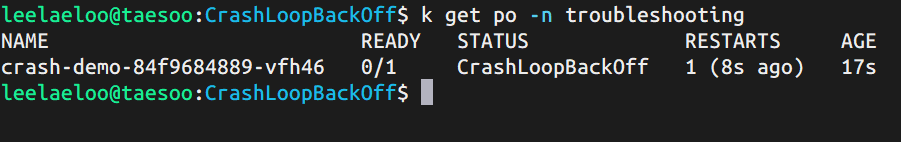
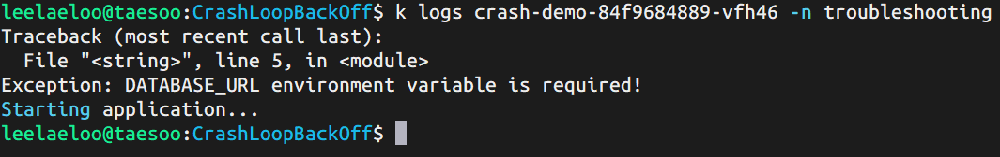
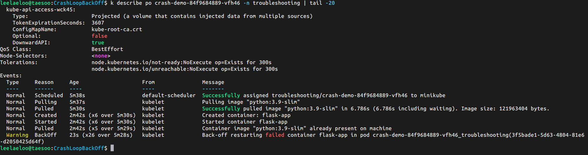
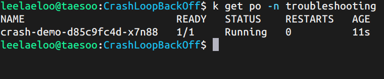

# 🐋 CrashLoopBackOff 트러블슈팅

## 개요

필수 환경변수 누락으로 인한 컨테이너 시작 실패 및 CrashLoopBackOff 에러 재현 및 해결

## 문제 재현

### 배포

```bash
kubectl apply -f broken-deployment.yaml
kubectl get pods -n troubleshooting -w
```

### 에러 발생



Pod가 `CrashLoopBackOff` 상태로 계속 재시작됨

**주요 증상:**

- STATUS: `CrashLoopBackOff` 또는 `Error`
- RESTARTS: 숫자가 계속 증가
- READY: `0/1`

---

## 원인 분석

### 1. 컨테이너 로그 확인

```bash
kubectl logs crash-demo-<pod-name> -n troubleshooting
```



**에러 메시지:**

```
Starting application...
Traceback (most recent call last):
  File "<string>", line 5, in <module>
Exception: DATABASE_URL environment variable is required!
```

### 2. Pod Events 확인

```bash
kubectl describe pod crash-demo-<pod-name> -n troubleshooting | tail -20
```



**핵심 에러:**

- `Back-off restarting failed container`
- Exit Code: 1 (에러로 종료)
- 컨테이너가 시작 후 즉시 실패

### 3. 원인 분석

- **필수 환경변수 누락**: `DATABASE_URL`이 설정되지 않음
- 애플리케이션이 환경변수 검증 후 Exception 발생
- 컨테이너가 Exit Code 1로 종료
- Kubernetes가 자동으로 재시작 시도
- 실패가 반복되면서 **Exponential Backoff** 진입

---

## 해결 방법

### 1. 환경변수 추가

```yaml
# broken-deployment.yaml
spec:
  containers:
  - name: flask-app
    image: python:3.9-slim
    # env 섹션 없음!

# fixed-deployment.yaml
spec:
  containers:
  - name: flask-app
    image: python:3.9-slim
    env:
    - name: DATABASE_URL
      value: "postgresql://localhost:5432/mydb"
```

### 2. 재배포

```bash
kubectl delete -f broken-deployment.yaml
kubectl apply -f fixed-deployment.yaml
kubectl get pods -n troubleshooting
```

### 3. 정상 동작 확인



**정상 상태:**

- STATUS: `Running`
- RESTARTS: `0`
- READY: `1/1`

---

## CrashLoopBackOff 주요 원인

| 원인                          | 설명                | 해결 방법                   |
| ----------------------------- | ------------------- | --------------------------- |
| **환경변수 누락**             | 필수 설정값 없음    | env, ConfigMap, Secret 설정 |
| **애플리케이션 에러**         | 코드 실행 실패      | 로그 확인 후 코드 수정      |
| **의존성 문제**               | 라이브러리 누락     | requirements.txt 확인       |
| **외부 서비스 연결 실패**     | DB, API 연결 불가   | 네트워크, DNS 확인          |
| **잘못된 entrypoint/command** | 실행 명령어 오류    | 명령어 경로 확인            |
| **권한 문제**                 | 파일 접근 권한 없음 | SecurityContext 설정        |
| **메모리 부족 (OOMKilled)**   | 메모리 제한 초과    | limits 조정                 |

---

## 디버깅 체크리스트

**단계별 확인 순서:**

1. **Pod 상태 확인**

```bash
   kubectl get pods -n troubleshooting
```

- RESTARTS가 증가하는가?
- STATUS가 CrashLoopBackOff인가?

2. **컨테이너 로그 확인** (가장 중요!)

```bash
   kubectl logs <pod-name> -n troubleshooting
   kubectl logs <pod-name> -n troubleshooting --previous  # 이전 컨테이너 로그
```

- 어떤 에러 메시지가 있는가?
- 어느 단계에서 실패하는가?

3. **Pod Events 확인**

```bash
   kubectl describe pod <pod-name> -n troubleshooting
```

- Exit Code 확인 (0이 아니면 에러)
- Back-off 메시지 확인

4. **리소스 확인** (OOMKilled 의심 시)

```bash
   kubectl top pod <pod-name> -n troubleshooting
```

5. **환경변수 확인**

```bash
   kubectl exec <pod-name> -n troubleshooting -- env
```

---

## Exit Code 의미

| Exit Code | 의미        | 일반적인 원인                |
| --------- | ----------- | ---------------------------- |
| **0**     | 정상 종료   | 프로그램이 정상적으로 완료됨 |
| **1**     | 일반 에러   | 애플리케이션 에러, 예외 발생 |
| **2**     | 잘못된 사용 | 명령어 인자 오류             |
| **126**   | 실행 불가   | 파일 권한 문제               |
| **127**   | 명령어 없음 | 실행 파일을 찾을 수 없음     |
| **137**   | SIGKILL     | OOMKilled (메모리 부족)      |
| **143**   | SIGTERM     | 정상적인 종료 신호           |

---

## Exponential Backoff

Kubernetes는 실패한 컨테이너를 재시작할 때 대기 시간을 점진적으로 증가시킵니다:

```
재시도 1: 즉시
재시도 2: 10초 후
재시도 3: 20초 후
재시도 4: 40초 후
재시도 5: 80초 후
...
최대: 5분
```

이는 시스템 과부하를 방지하기 위한 메커니즘입니다.

---

## 학습 포인트

- **CrashLoopBackOff**: 컨테이너가 시작 후 계속 실패하는 상태
- **로그가 핵심**: `kubectl logs`로 정확한 에러 원인 파악
- **Exit Code**: 0이 아니면 비정상 종료
- **환경변수 검증**: 애플리케이션 시작 전 필수 설정 확인
- `--previous` 플래그로 이전 컨테이너 로그도 확인 가능

---

## 추가 테스트

### 다른 실패 시나리오 재현

**1. OOMKilled 테스트:**

```yaml
resources:
  limits:
    memory: "10Mi" # 매우 작은 메모리
```

**2. 잘못된 명령어:**

```yaml
command: ["nonexistent-command"]
```

**3. 파일 없음:**

```yaml
command: ["python", "missing_file.py"]
```

---

## 관련 문서

- [Kubernetes Debug Running Pods](https://kubernetes.io/docs/tasks/debug/debug-application/debug-running-pod/)
- [Container Lifecycle](https://kubernetes.io/docs/concepts/workloads/pods/pod-lifecycle/)
- [Exit Codes](https://kubernetes.io/docs/tasks/debug/debug-application/determine-reason-pod-failure/)

---

## 정리

```bash
kubectl delete -f broken-deployment.yaml
kubectl delete -f fixed-deployment.yaml
# 또는
kubectl delete namespace troubleshooting
```

---

## 파일 구조

```
CrashLoopBackOff/
├── README.md
├── broken-deployment.yaml
├── fixed-deployment.yaml
├── screenshots/
│   ├── pod-status.png
│   ├── container-logs.png
│   ├── describe-events.png
│   └── fixed-status.png
└── logs/
    ├── pod-status.txt
    ├── container-logs.txt
    └── describe-output.txt
```
