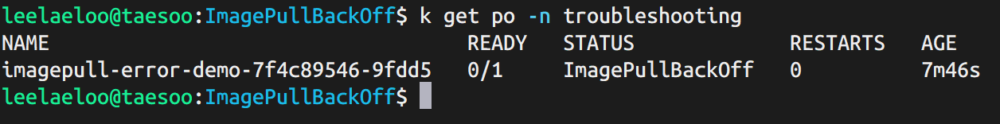
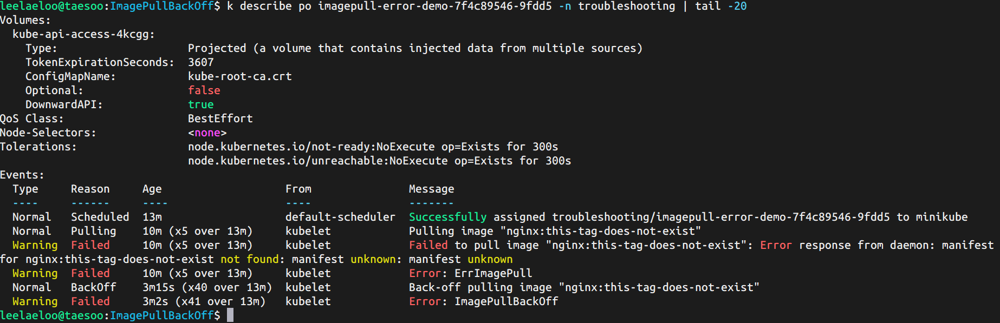
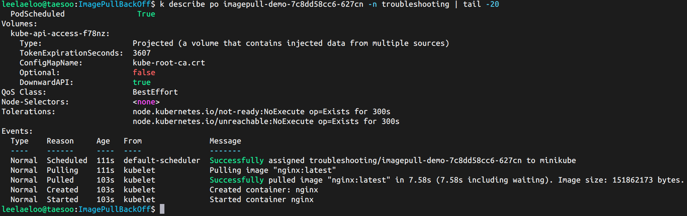

# 🐋 ImagePullBackOff 트러블슈팅

## 개요

존재하지 않는 이미지 태그로 인한 ImagePullBackOff 에러 재현 및 해결

---

## 문제 재현

### 배포

```bash
kubectl create namespace troubleshooting
kubectl apply -f broken-deployment.yaml
kubectl get pods -n troubleshooting
```

### 에러 발생



Pod가 `ImagePullBackOff` 상태로 컨테이너 이미지를 가져오지 못함

---

## 원인 분석

### 상세 정보 확인

```bash
kubectl describe pod <pod-name> -n troubleshooting
```

### 에러 메시지



**핵심 원인:**

- 존재하지 않는 이미지 태그: `nginx:this-tag-does-not-exist`
- Docker Hub에 해당 태그가 없음
- 에러: `manifest unknown`

---

## 해결 방법

### 1. 이미지 태그 수정

```yaml
# 잘못된 이미지
image: nginx:this-tag-does-not-exist

# 올바른 이미지
image: nginx:latest
```

### 2. 재배포

```bash
kubectl delete -f broken-deployment.yaml
kubectl apply -f fixed-deployment.yaml
kubectl get pods -n troubleshooting
```

### 3. 정상 동작 확인



Pod가 `Running` 상태로 정상 동작

---

## ImagePullBackOff 주요 원인

| 원인                 | 설명                          | 해결 방법                       |
| -------------------- | ----------------------------- | ------------------------------- |
| **이미지 태그 오타** | 잘못된 태그 이름 사용         | Docker Hub에서 정확한 태그 확인 |
| **인증 실패**        | 프라이빗 레지스트리 접근 불가 | `imagePullSecrets` 설정         |
| **네트워크 문제**    | 레지스트리 연결 실패          | 네트워크 및 방화벽 확인         |
| **이미지 미존재**    | 삭제되었거나 없는 이미지      | 이미지 존재 여부 확인           |
| **Rate Limit**       | Docker Hub 다운로드 제한 초과 | 인증 후 재시도 또는 대기        |

---

## 디버깅 팁

**빠른 확인 순서:**

1. `kubectl get pods` → 상태 확인
2. `kubectl describe pod` → Events 섹션 확인
3. 이미지 이름/태그 오타 체크
4. Docker Hub 또는 레지스트리에서 이미지 존재 여부 확인
5. 프라이빗 이미지인 경우 Secret 설정 확인

---

## 학습 포인트

- **ImagePullBackOff**: 이미지 가져오기 실패 후 재시도 중
- **ErrImagePull**: 첫 번째 pull 시도 실패
- **Exponential Backoff**: 재시도 간격이 점진적으로 증가 (10s → 20s → 40s...)
- `kubectl describe`의 **Events 섹션**이 디버깅의 핵심

---

## 정리

```bash
kubectl delete namespace troubleshooting
```

---

## 파일 구조

```
ImagePullBackOff/
├── README.md
├── broken-deployment.yaml      # image: nginx:this-tag-does-not-exist
├── fixed-deployment.yaml       # image: nginx:latest
├── screenshots/
│   ├── pod-status.png
│   ├── describe-events.png
│   └── fixed-status.png
└── logs/
    └── describe-output.txt
```
